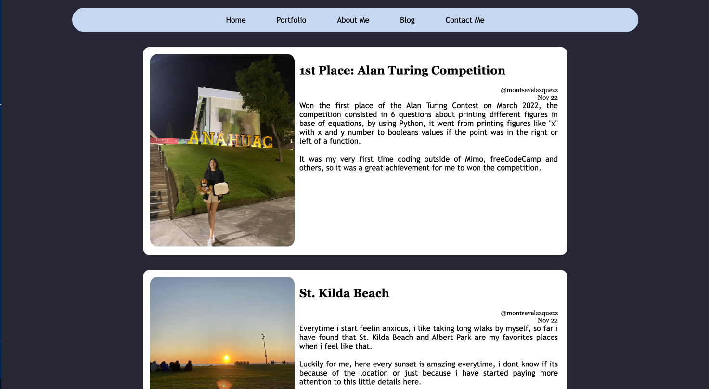

# Portfolio 
by Montserrat Delgado Velazquez 

> Netlify: (URL)

> GitHub: (URL)

> Presentation: [Presentation](https://youtu.be/J1Tre7iGTnY)

> SlideDeck: [Portfolio SlideDeck](https://www.canva.com/design/DAFRxiMIFtk/h4rIEhYfON5NZgoh8ky10Q/view?utm_content=DAFRxiMIFtk&utm_campaign=designshare&utm_medium=link2&utm_source=sharebutton)

### **Objective:**

The objective of this portfolio is to put in practice what we have been learning so far, from learning the structure and semantics of HTML. Learn how we can style our code, override designs for making good looking sites and making responsive designs using the right properties and units, so every device is able to see our site as it supposed to. 

The **functionality** of my protfolio is to use for interviews, since it will be my programmer resume, and it will be updated whenever is required to, because of new projects, skills, languages and others, because it will become a way to introducing myself to companies and people. 

### **SiteMap**

> Home is the main page, it has 4 child pages, which are the orange boxes (Portfolio, About Me, Blog, Contact Me), the brownie boxes (GitHub Repositories, Resukme, etc.) are the  external links that each child page have, so in this case on Portfolio there are links that goes to the GitHub repositories in this case. 

### **Portfolio Pages**

> **Home Laptop View**

> **Home iPad View**

> **Portfolio Laptop View**

> **Portfolio iPad View**

> **About Me Laptop View**

> **About Me iPad View**

> **Blog LapTop View**

> **Blog iPad View**

> **Contact Me Laptop View**

> **Contact Me iPad View**

My **target audience** will be other developers as well, since i think that we all should share our own projects and achievements, so i can show my work and for them to maybe find some inspiration if thye need or even reach me, and also is targeted to companies that are looking for people to work with them, second opinions, even inspiration. 

### **Tech Stacks** 
>**HTML:**
<ul>
  <li>Header</li>
  <li>Body</li>
  <li>Main</li>
  <li>Section</li>
    <li>Img</li>
  <li>Paragraphs</li>
  <li>Headers (h1,h2,...)</li>
   <li>Aside</li>
  <li>Alt attributes</li>
  <li>Div</li>
  <li>Button</li>
  <li>Lists</li>
   <li>Anchor Tags</li>
  <li>Hr Selectors</li> 
</ul>

>**CSS:**
<ul>
  <li>Background-color</li>
  <li>Color</li>
  <li>Hexadecimal</li>
  <li>Section</li>
    <li>classes</li>
  <li>ID's</li>
  <li>Grid</li>
   <li>Flexbox</li>
  <li>Box-sizing</li>
  <li>Media Querries</li>
  <li>pseudo-class</li>
</ul>

>**SCSS:**
<ul>
    <li>Variables</li>
    <li>Mixins</li>
    <li>Nesting</li>
</ul>

> **Netlify** for sharing the webpage

>**VS Code** for coding the whole page

#### **References Images:**
 - Freepik.(2010-2022)._Instagram Logo free icon._ [Flaticon.](https://www.flaticon.com/free-icon/instagram-logo_87390)
 - GitHub.(2022)._GitHub Logos and Usage._ [GitHub](https://github.com/logos)
 - Linkedin.(2022)._Linkedin Brand: Our Logo._[Linkedin](https://brand.linkedin.com/downloads)
 - All other pictures used on the page are of my own property, Delgado Velazquez Montserrat. 
